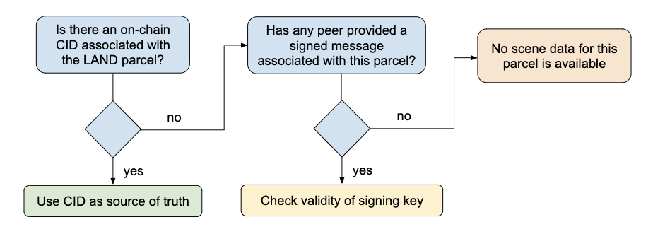
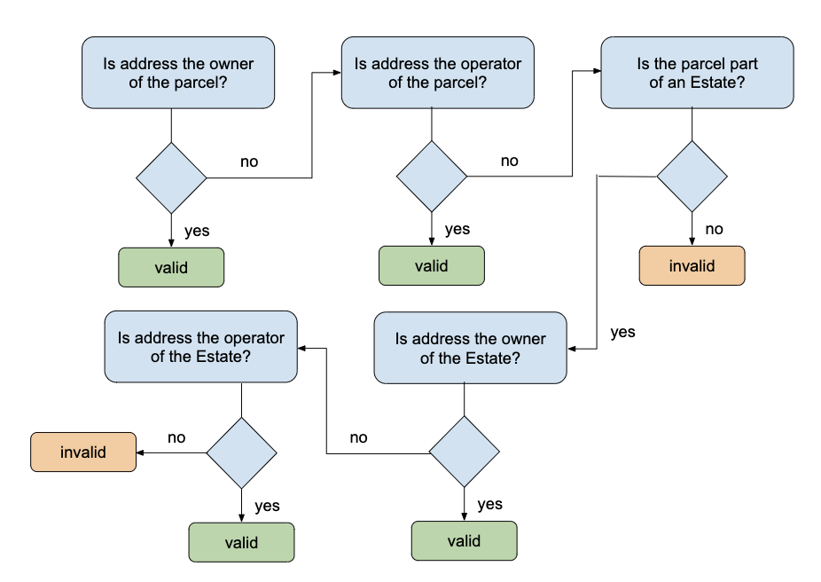
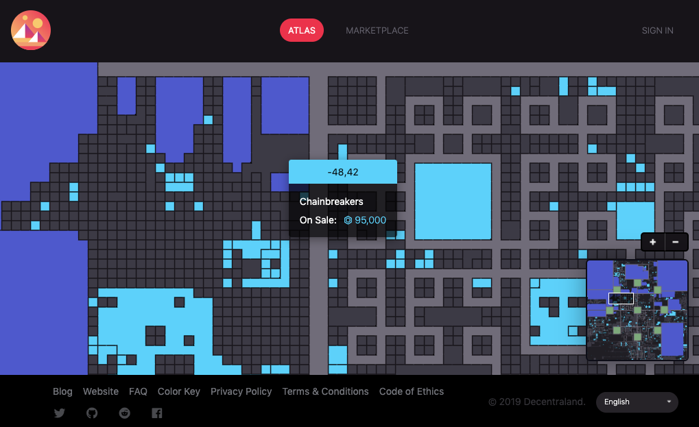
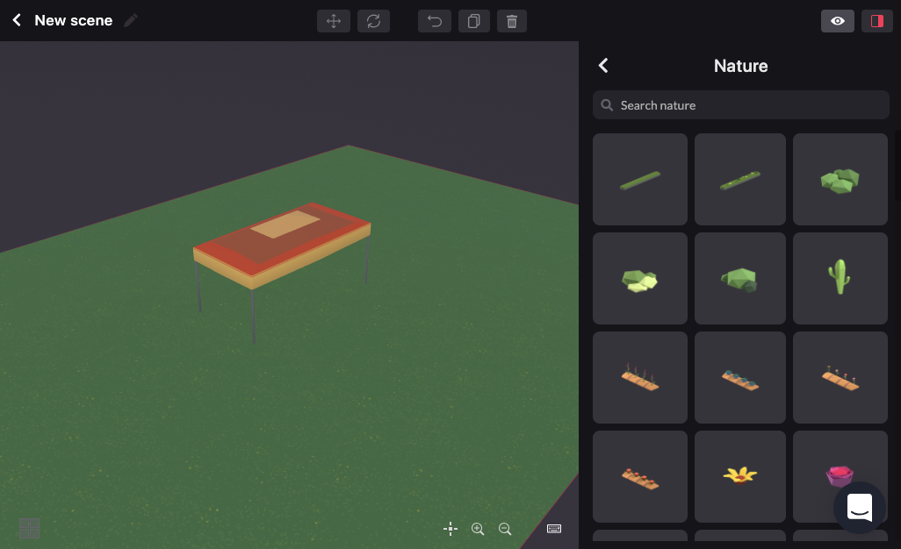
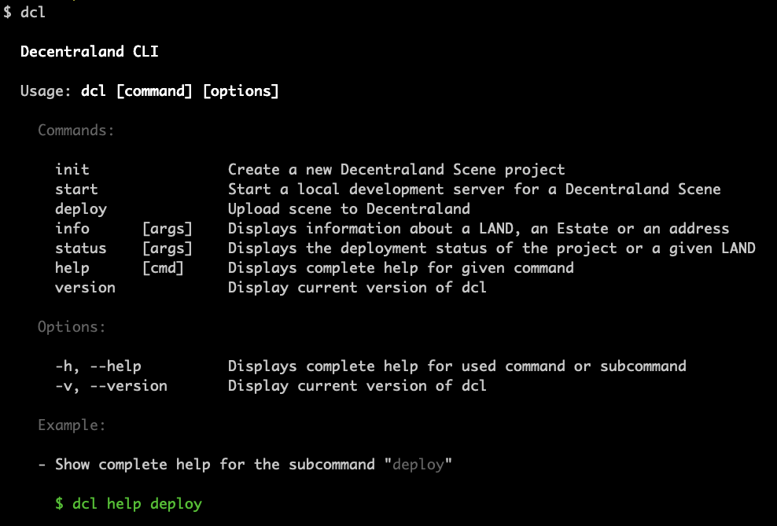
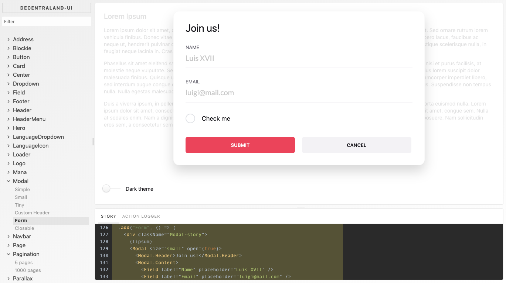

<pre>
  DSP: 0002
  Title: State of the Metaverse
  Author: Esteban Ordano <esteban@decentraland.org>
  Status: Draft
  Type: Informative
  Created: 2019-04-10
</pre>

# State of the Metaverse

## Abstract

This document explains the technical foundations of the Decentraland technology stack. It provides an eagle's eye view of the different components and networks that make this decentralized virtual reality possible, discusses the current status of different implementations, and summarizes the proposals for future upgrades and features.

Decentraland is a finite, traversable 3D world divided in square segments ("LAND parcels") identified by their cartesian coordinates. LAND is a non-fungible digital asset stored on the Ethereum blockchain along the address that owns and controls each parcel. LAND owners use an arbitrary data field of the smart contract to allow others to discover and download the files needed to display content on that LAND parcel.

Each user (or "player") connects to this virtual world by the use of an user agent (also referred to as "client" or "explorer"), a program that displays the scenes around the user, downloads the required assets to do so, displays other users and enables communications with them. A single position is associated with each user, controlled by each individual user agent. A user agent's main responsibilities are:

* Download the assets required to display scenes around the user's position
* Connect to communication servers and other clients
* Interpret the scripts that describe each scene's behavior

Every scene contains a file named "`scene.json`", a description of the scene comprising which 3D models to place (and where), which server to use to coordinate communications between nearby users, policies to signal what kind of content can be found in the scene, among other information required to enable the features of the client.

Some activities that impact the virtual world might take place outside of its 3D representation. The ecosystem of Decentraland also contains a number of "dApps", decentralized applications that support different economic and social aspects of the virtual world. Examples of these are "the Marketplace" -- a decentralized market that allows trusted exchange of virtual goods relevant to the experience; and "Agora" -- an off-chain voting mechanism that allows members of the community to coordinate future improvements to the platform. Other tools relevant to the ecosystem are the Software Development Kit -- a set of tools used to create scenes; the Builder -- a visual interface that anybody can use to decorate a scene without knowing how to code; and the Decentraland Specification Proposals -- a set of specifications and guidelines, of which this document is part of.

## Ownership Layer

Decentraland uses the Ethereum network in order to maintain a decentralized ledger of ownership of LAND parcels.

### The LAND Smart Contract

As described in [DSP 0010: LAND Contract], the ledger of ownership of each LAND parcel is established by the contract located in Ethereum's mainnet at the `0xF87E31492Faf9A91B02Ee0dEAAd50d51d56D5d4d` address. This contract is [ERC721] compliant, and stores the following fields for each parcel:

* `owner`: The address that has ultimate control over the parcel
* `approval`: An `address` that is allowed to transfer the token and modify its data
* `updateOperator`: An `address` that is allowed to modify a token's data
* `assetData`: Arbitrary data field associated with this parcel

Additionally, each Ethereum address might have the following information associated on this contract:

* `operator`: An `address` that is allowed to transfer any token
* `ping`: UNIX timestamp (in seconds) of the last interaction of an `address` with this contract


### The Estate Smart Contract

Defined by [DSP 0014: Estate Contract], the Estate smart contract is the most successful Composable Non-Fungible Token in the Ethereum network, and one of the most traded NFTs according to [OpenSea's ranking]. A composable NFT is an NFT that has the ability to transfer other NFTs in and out of it, grouping them together. An Estate is an NFT that holds multiple LAND tokens together, keeping ownership information. This feature was built so users can save on gas fees when transferring, selling, or managing their land.

### Decentralized NFT Marketplaces

The two smart contracts for buying and selling NFT items on Ethereum's mainnet are the Marketplace (located at `0x8e5660b4ab70168b5a6feea0e0315cb49c8cd539`) and the Bids feature (located at `0xe479dfd9664c693b2e2992300930b00bfde08233`).

These contracts were designed with the following goals:

- Enable a secure trust-free exchange of items for MANA.
- Transactions might happen without any reliance on third-parties other than miners.
- Contracts should not charge any fees. If fees are collected, the MANA should be burned (taken out of circulation).
- As an Ethereum citizen, the contract should be ready for storage rent and not waste storage space.

For the purposes of making it easier to access, a dApp called "Marketplace" was built (the source code can be found at [github.com/decentraland/marketplace](https://github.com/decentraland/marketplace)). This frontend dApp has had moderate success, features an atlas view of all the LAND parcels, Estates, and visualization of which ones are for sale. It requires a backend API that provides a summary of all the information from the LAND, Estates, Markets, and MANA contracts of Ethereum. One instance of this marketplace runs at https://market.decentraland.org.

### Other smart contracts

The project relies on several other contracts deployed on the Ethereum network:

- [**Burner contract**](https://github.com/decentraland/aux-contracts/tree/master/marketplace-burner): A contract that can only burn the ERC20 tokens it receives.
- [**Auction**](https://github.com/decentraland/land-auction/tree/master/contracts/auction): A contract that was used for Decentraland's second LAND auction.
- [**Passthrough**](https://github.com/decentraland/pass-through): A contract that can blacklist certain methods from being called to a target contract.
- **Vesting**: Vesting contracts used to release tokens continuously over time.

## Distribution and Verification of Content

What is going on in the LAND parcel 13,37?

In order to render the content and communicate with other users positioned on top of that parcel, the user agent needs to link those coordinates with a parcel definition (or parcel manifest). There are two ways to do this:

1) The NFT has a URL and [CID](https://docs.ipfs.io/guides/concepts/cid/) that allows the user agent to use the IPFS network to download a folder containing the conted required to render the scene
2) The user agent communicates with known peers or a content server that keeps a properly authorized copy of the files required to render and interact with the scene.

In other words, the user agent follows this algorithm to determine what's the current parcel manifest for a scene:



### Verification of a Parcel Manifest's Authenticity

If a random peer or website has provided a parcel manifest file, along with a signature (which follows the structure of an IPNS signed message with an secp256k1 signature), this is the algorithm that should be followed in order to verify its authenticity:



#### Decentraland's IPFS Content Server HTTP API

Most of the Decentraland implementations currently use a federation of content servers in order to facilitate faster access to scene files than another distributed method.

See https://github.com/decentraland/content-service for more information.

### Algorithm to load surrounding parcels

The current implementations of Decentraland use the following algorithm to keep a list of surrounding parcels. The global state of this algorithm contains these variables:

* `position`: The player's position
* `LoadedScenes`: The set of scenes that have been loaded or started loading
* `WorldMapper`: A service that maps LAND coordinates to the most recent and valid Scene Manifest received. It also avoids overlapping/misdeployed scenes.

The algorithm itself has three steps:

#### (1) Fetch and reconcile scenes to load:

* Let `Coordinates` be the set of coordinates of all parcels in the visible radius from `position`
* Let `ScenesToLoad` be an empty set of `Scenes`
* For every `C` in `Coordinates`
  * Let `S`, a Scene Manifest, be `WorldMapper.scene(C)`
  * Add `S` to `ScenesToLoad`

#### (2) Select which scenes should be loaded:
* For every `S` in `ScenesToLoad`
  * If `S` ∉ `LoadedScenes`:
    * Load scene `S`
    * Add `S` to `LoadedScenes`

#### (3) Load and unload scenes
* For every `S` in `LoadedScenes`
  * If `S` ∉ `ScenesToLoad`
    * Unload scene `S`
    * Remove `S` from `LoadedScenes`

### Parcel Manifest

Every scene requires a number of configuration parameters and input information so user agents can display the scene correctly and connect to other clients. These fields include the IPFS CIDs of other materials required (models, scripts, textures, sounds...) as well as policy of how should the clients render and behave (whether flying is allowed, what are safe teleporting areas where clients might appear, which communications server to use to communicate with others...).

This is an example parcel manifest that showcases some of those features:

    {
      "assets": {
        "scene.js": "/ipfs/QmZ1d5v83XSM7xbKDVAdFgS1PZmCzxuF5UtYrjMtFt6d6b",
        "material_wood": "/ipfs/QmZ1d5v83XSM7xbKDVAdFgS1PZmCzxuF5UtYrjMtFt6d6b",
        "material_iron": "/ipfs/QmZ1d5v83XSM7xbKDVAdFgS1PZmCzxuF5UtYrjMtFt6d6b",
        "door_model": "/ipfs/QmZ1d5v83XSM7xbKDVAdFgS1PZmCzxuF5UtYrjMtFt6d6b",
        "favicon_asset": "/ipfs/QmZ1d5v83XSM7xbKDVAdFgS1PZmCzxuF5UtYrjMtFt6d6b",
        "background_music": "/ipfs/QmZ1d5v83XSM7xbKDVAdFgS1PZmCzxuF5UtYrjMtFt6d6b",
        "snapshot": "/ipfs/QmZ1d5v83XSM7xbKDVAdFgS1PZmCzxuF5UtYrjMtFt6d6b",
        "lod50": "/ipfs/QmZ1d5v83XSM7xbKDVAdFgS1PZmCzxuF5UtYrjMtFt6d6b"
      },
    
      "contact": {
        "name": "John Doe",
        "email": "john@doe.com"
      },
    
      "main": "scene.js",
    
      "scene": {
        "base": "2,2",
        "parcels": [
          "1,2", "1,3", "1,4",
          "2,2", "2,3", "2,4",
          "3,2", "3,3", "3,4"
        ]
      },
    
      "communications": {
        "type": "commsv2",
        "server": "https://comms.decentraland.org"
      },

      "spawnPoints": [
        {
          "position": {
            "x": 1.3, "y": 1.4, "z": 18.34
          },
          "rotation": {
            "x": 0, "y": 180, "z": 0
          },
          "default": true
        },
        {
          "area": {
            "x": [1.3, 2.5],
            "y": [0, 0],
            "z": [20, 20]
          }
        }
      ],
    
      "policy": {
        "contentRating": "E",
        "fly": "yes",
        "voiceEnabled": "yes",
        "blacklist": ["0,0", "1,0", "1,1", "1,1"],
      },
    
      "tags": ["land", "decentraland", "parcel"],
    
      "display": {
        "title": "My Land",
        "favicon": "favicon_asset",
        "preview": {
          "snapshot": "snapshot",
          "loadingColor": "#15ffae",
          "lod50": "lowres"
        }
      }
    }

### Scripting Scenes

Parcel manifest files includes a field named `main`, that should point to a javascript file that gets executed simmultaneously by each user agent. The API is exposed in a similar way to how webworkers in browsers communicate with the main javascript thread.

[DSP-0031] describes the main API and how the Entity-Component-System works. This is an example script that makes a cube float while rotating:

```
// Create a group to track all entities with a Transform component
const myGroup = engine.getComponentGroup(Transform)

// Define a System
export class RotatorSystem implements ISystem {
  // The update function runs on every frame of the game loop
  update() {
    // The function iterates over all the entities in myGroup
    for (let entity of myGroup.entities) {
      const transform = entity.get(Transform)
      transform.rotate(Vector3.Left(), 0.1)
    }
  }
}

// Add the system to the engine
engine.addSystem(new RotatorSystem())

// Create an entity
const cube = new Entity()

// Give the entity a transform component
cube.add(new Transform({
    position: new Vector3(5, 1, 5)
  }))

// Give the entity a box shape
cube.add(new BoxShape())

// Add the entity to the engine
engine.addEntity(cube)
```

The API also contains features to control animations of 3D models, sounds, UI, text, management of click events, amongst others. Check out [DSP-0033] through [DSP-0039] for a description of those APIs.

## Identity and Communications

// TODO: @hugo

## Supporting dApps & Tooling

### Marketplace

The Marketplace is a frontend web application that makes the interaction with the Marketplace and Bids contracts easy and user friendly. It uses a backend server that indexes the blockchain and provides faster access to all the information from the contract's state than what the `web3` API can provide.

https://github.com/decentraland/marketplace

https://marketplace.decentraland.org



### Agora

Agora is an off-chain voting tool that can be used with any ERC-20 token that has been used to poll the community on different high-impact decisions for the protocol.

https://github.com/decentraland/agora

https://agora.decentraland.org


### Builder

The builder is an easy-to-use point-and-click decorating tool that allows anybody to build a scene fast, create layouts that can be later modified with code, and collaborate by sharing projects with others.

https://github.com/decentraland/builder

https://builder.decentraland.org



### CLI

The `cli` for Decentraland allows developers to create scenes, query the blockchain for the current state of different lands, and deploy to content servers.

https://github.com/decentraland/cli

```npm install -g decentraland```



### `decentraland-ui` and `decentraland-dapps`

These two open source projects are key pieces of our frontend architecture and allow dApps developers to get started fast and build high quality web applications, based on `typescript`, `React`, `redux`, and `semantic-ui`.

https://github.com/decentraland/decentraland-dapps

https://ui.decentraland.org



## Final remarks

Thank you for reading this far `o/`! We hope you enjoyed this technical introduction to how Decentraland works, and join our efforts to create the Internet's first massive virtual world owned by its users!


[DSP 0010: LAND Contract]: (./0010.mediawiki)
[DSP 0014: Estate Contract]: (./0014.mediawiki)
[OpenSea's ranking]: (https://opensea.io/rankings)
[ERC721]: (https://github.com/ethereum/EIPs/blob/master/EIPS/eip-721.md)
